# Hadoopi - the Raspberry Pi Hadoop cluster

This project contains the configuration files and chef code to configure a cluster of five Raspberry Pi 3s as a working Hadoop running Hue.

This video shows how to set up and configure the cluster using this code.

The versions of installed Hadoop components are:

* hadoop 2.6.4
* hue 3.11.0
* hbase 1.2.4
* pig 0.12.1
* hive 1.2.1
* spark 1.6.2
* livy 0.2.0
* oozie 4.3.0
* sqoop 1.99.4
* solr 4.10.4
* impala - not supported

## Inspiration
Running Hadoop on Rasberry Pis is not a new idea, a lot of work has been done by individuals and I wanted to make sure their efforts were recognised. Their work and formed the basis of my attempts and inspired me to start the project.

*	Jamie Whitehorn - https://www.youtube.com/watch?v=n6ONKshWSMg
* Jonas Widrikson - http://www.widriksson.com/raspberry-pi-2-hadoop-2-cluster/
* Carsten Mönning - https://blogs.sap.com/2015/04/25/a-hadoop-data-lab-project-on-raspberry-pi-part-14/
* Bram Vandewalle - http://www.becausewecangeek.com/building-a-raspberry-pi-hadoop-cluster-part-1/
* DQYDJ - https://dqydj.com/raspberry-pi-hadoop-cluster-apache-spark-yarn/

## Objectives
###	Learn
My day job uses the Cloudera distribution of Hadoop, which provides a great management interface, but that means I'm somewhat shielded from the inner workings of Hadoop configuration and tooling. I decided to put this distribution together to see if was feasible/practical to run Hadoop on a cluster of Raspberry Pis, but also to get more exposure to it's tooling and configuration. At the same time I wanted a feature rich and easy to use "suite" of tools so I based the project around Hue. I also wanted it to be easily recreateable so used Chef.

###	Caveats
There are some caveates to bear in mind when using this tool.

* No Impala - don't think the Pi has enough power whilst running other Hadoop components - happy to receive pull requests :-)
* No Sentry - access to the data on the cluster will be based around HDFS security  
* Not a production reference - it's a learning exercise, given the performance of the cluster you really wouldn't want to run anything "real" on there.
* Teeny amount of memory so only basic stuff - The 1GB of ram on the Pi is a real limitation, you're really only going to be able to one task at a time, so go easy on it
* Its slowwwwwwwww - the combination of teeny amount of RAM, 4 cores and wifi networking means this is built for speed, be realistic with your expectations!
* Setup requires basic linux command line fu and understanding of network configuration - you are going to be compiling applications, running chef code and possibly doing a little fault finding, you'll need some basic linux sysadmin skills for this.
* It's compiles and configures correctly as of NOW - there are loads of dependencies on 3rd party libraries and packages, both when compiling binaries or configuring the cluster, but things get move, deleted or just change, you'll need be able to diagnose problems and change settings.
* Ask if you want help - github issues are ideal but please be clear in what attempts you have made to diagnose and fix.

## The hardware
To build the cluster you are going to need:

* 5 x Raspberry Pi 3s
* Nylon Spacers to stack the Pis
* Acrylic Raspberry Pi case for base and lid to keep the dust off
* Wireless Router - I'm using a TP-Link tl-wr802n travel router
* Anker 60w 6 usb port hub
* 6 usb cables
* 5 x Samsung Evo+64GB micro sd cards
* Computer for administering via ssh, running a webserver and a web browser to access Hue

Just a quick note on the micro sd cards, perfromance of cards can vary wildly, I was recommended the Evo+ cards as their performance at reading and writing small files was very good, you can check the performance of yours using  https://github.com/geerlingguy/raspberry-pi-dramble/blob/master/setup/benchmarks/microsd-benchmarks.sh

## Making Binaries
Although most of hadoop eco system is written in java and available in binary format, there are some components that need to be built for the target architecture for performance. As the Raspberry Pi is ARM based we simply can't take the precompiled binaries and run them, we're going to have to compile those. These are Hadoop (with the correct version of protobuf libraries that we will also need to build), Oozie and Hue.

Install the Rasbian Jessie Lite version dated 23/09/16 onto you sd card, the development of the project was based around this version.

    http://downloads.raspberrypi.org/raspbian/images/raspbian-2016-09-28/

This version has a few "features" that are really useful, firstly it will auto expand the file system on first boot, secondly the SSH server is enabled by default (which is probably an error) but it means we can configure the Pi headless without the need of doing basic service config without the fuss of connecting a keyboard and monitor.

### Compile protobuf
Locate you Pi's ip address (via some form of network scan, or go through the fuss of connect a monitor and keyboard) then ssh to it as the pi user. then download and unpack the protobuf v2.5 source, tweak the build script so that it refers to the new location of the google test suite and build and install the libraries:

	sudo -i
	apt-get update
	apt-get install dh-autoreconf
	wget https://github.com/google/protobuf/archive/v2.5.0.zip
	unzip v2.5.0.zip
	cd protobuf-2.5.0
	vi autogen.sh

Change the references to the google test suite:

	# Check that gtest is present.  Usually it is already there since the
	# directory is set up as an SVN external.
	if test ! -e gtest; then
	  echo "Google Test not present.  Fetching gtest-1.5.0 from the web..."
	  wget https://github.com/google/googletest/archive/release-1.5.0.zip
	  unzip release-1.5.0.zip
	  mv googletest-release-1.5.0 gtest
	fi

Then generate the build configuration files

	./autogen.sh
	./configure --prefix=/usr

Build and install protobuf

	make
	make check
	make install

### Compile Hadoop
We now need to compile the Hadoop binaries, download and unpack the Hadoop 2.6.4 source, tweak pom.xml so it bypasses the documentation generation as this fails on the Pi, apply the HADOOP-9320 patch and build the binary.

	cd
	apt-get install oracle-java8-jdk

	wget http://apache.mirror.anlx.net/hadoop/common/hadoop-2.6.4/hadoop-2.6.4-src.tar.gz
	tar -zxvf hadoop-2.6.4-src.tar.gz
	vi hadoop-2.6.4-src/pom.xml

Disable the problem step in by adding the following to &lt;properties>...&lt;/properties>

	    <additionalparam>-Xdoclint:none</additionalparam>

Next apply the HADOOP-9320 patch

	cd hadoop-2.6.4-src/hadoop-common-project/hadoop-common/src
	wget https://issues.apache.org/jira/secure/attachment/12570212/HADOOP-9320.patch
	patch < HADOOP-9320.patch
	cd ~/hadoop-2.6.4-src/

Next install a whole bunch of build tools and libraries:

	apt-get install maven build-essential autoconf automake libtool cmake zlib1g-dev pkg-config libssl-dev libfuse-dev libsnappy-dev libsnappy-java libbz2-dev

Then run the build using maven

	sudo mvn package -Pdist,native -DskipTests -Dtar

Once build package the archive ready for deployment

	cd hadoop-dist/target/
	cp -R hadoop-2.6.4 /opt/hadoop-2.6.4
	cd /opt
	tar -zcvf /root/hadoop-2.6.4.armf.tar.gz hadoop-2.6.4

### Compile Hue
Download the Hue 3.11.0 source, unpack it, apply the necessary patches and tweak the spark_shell.py so it defaults to 256MB for spark driver and executor memory rather than 1GB.

Install the build dependencies:

	apt-get install python-dev libsasl2-dev libxml2-dev libxslt-dev libkrb5-dev libffi-dev libldap2-dev libmysqlclient-dev libsqlite3-dev libgmp3-dev libssl-dev

Download and unpack the Hue source

	cd /opt
	wget https://dl.dropboxusercontent.com/u/730827/hue/releases/3.11.0/hue-3.11.0.tgz
	tar -zxvf hue-3.11.0.tgz
	cd hue-3.11.0

Download the patch to fix the example loading issues with 3.11.0, patch the desktop/core/src/desktop/api2.py and desktop/core/src/desktop/tests_doc2.py files:

	wget https://github.com/cloudera/hue/commit/b059cec5c55737af3ceeb3a8cb2c0ce4e4d94b4d.patch
	patch < b059cec5c55737af3ceeb3a8cb2c0ce4e4d94b4d.patch

Change the driverMemory and executorMemory defaults from 1GB to 256MB in desktop/libs/notebook/src/notebook/connectors/spark_shell.py

Then build the apps
	make apps

Then package them up:

	cd /opt
	tar -zcvf /root/hue-3.11.0.armf.tar.gz hue-3.11.0

### Compiling Oozie
Finally we need to compile oozie. Download the oozie 4.3.10 source and unpack it, we need to change the target java version to 1.8 in the pom.xml file, then build the binaries, download the ext-2.2. library (to enable the oozie web interface) and copy to the applicable folder and package the files.

Download the files and unpack:

	cd
	apt-get install oracle-java8-jdk maven
	wget http://archive.apache.org/dist/oozie/4.3.0/oozie-4.3.0.tar.gz
	tar -zxvf oozie-4.3.0.tar.gz
	cd oozie-4.3.0/

Change the target java version to 1.8 in pom.xml, then set a few environment variables to stop the build process running out of memory, and build the binary:

	export MAVEN_OPTS='-Xmx512m -XX:MaxPermSize=128m'
	bin/mkdistro.sh -DskipTests -Puber

Now download the ext-2.2 library and package the files:

	cd /root/oozie-4.3.0/distro/target/oozie-4.3.0-distro/oozie-4.3.0
	mkdir libext
	cd libext
	wget http://archive.cloudera.com/gplextras/misc/ext-2.2.zip
	cd /root/oozie-4.3.0/distro/target/oozie-4.3.0-distro/
	tar -zcvf /root/oozie-4.3.0.armf.tar.gz oozie-4.3.0

### Making the Compiled Files Available
Transfer the compiled binary files to you computer and start the python webserver to make them available to the pis as you configure the cluster:
	python -m SimpleHTTPServer

## Installing and Configuring the Cluster
The cluster will comprise of 5 Raspberry Pis, 3 of them will be configured as worker nodes (worker01, worker02 and worker03) and have the HDFS Datnode and Yarn Nodemanager Hadoop components installed. The remaining two Pis will be setup as master01 and master02.

The master nodes will have the the Hadoop components:

master01
* HDFS Namenode
* Yarn Resource Manager
* Hue
* Hive
* Pig
* Oozie
* Sqoop

master02
* Hbase
* Zookeeper
* Spark & Livy
* Solr

### Networking
The cluster is setup to run on the 10.0.0.x network range:

* 10.0.0.11 - master01
* 10.0.0.12 - master02
* 10.0.0.21 - worker01
* 10.0.0.22 - worker02
* 10.0.0.23 - worker03
* 10.0.0.9  - administering computer running python webserver

The TP-Link router is setup in "WISP Client" mode so it bridges the two wifi networks from 10.0.0.x to 192.168.2.x that way I can set the cluster up so it has outbound internet connectivity from the 10.0.0.x network on via my 192.168.2.x network. The great advantage with this setup is the cluster and router can taken away from my 192.168.2.x network and use the cluster without having to reconfigure the network.

You can modify the network configuration by modifying the chef attributes or refactoring the network recipe. You may also want to add the nodes to your administering computer /etc/hosts file.

### Installing
Firstly write the Jessie Lite version dated 23/09/16 onto your sd cards. We will setup the Pis in turn, worker01-03 and then master02, for the final step when we setup master01 which will need all the Pi's powered on as it modifies files on the HDFS file system. This means you'll only need on pi connected to ethernet.

So insert the first sd card into one of your Pis, connect the ethernet cable and power it up, wait a minute whilst the Pi boots and  SSH into the pi, you can determine the ip address of your pi by either using a network scanner or by connecting a monitor to the hdmi port.

Once we have ssh'ed into the Pi we need to update the system:

    sudo -i
    apt-get update

Installed git and chef:

    DEBIAN_FRONTEND=noninteractive apt-get -y install chef git

Clone the code from github to the Pi:

    git clone https://github.com/andyburgin/hadoopi.git
    cd hadoopi

Set your wifi SSID and password as environment variables:

    export WIRESSID=myssid
    export WIREPASS=mypassword

Then run chef against the worker01.json file

    chef-solo -c solo.rb -j worker01.json

Wait for it to finish and:

    poweroff

**You now need to repeat these steps using a fresh sd card for worker02, worker03 and master02.**

For the setup of master01 place the final sd card in the pi with the ethernet connection, setup the remaining 4 pis with the previously configured sd cards and power up all of the pis. As before ssh into the Pi you are configuring, update the system, install git & chef, clone the code, set you network SSID & password, then run:

    chef-solo -c solo.rb -j master01.json

Then we need an extra chef run to install additional Hadoop components and configure files on the HDFS filesystem that runs across the cluster:

    chef-solo -c solo.rb -j master01-services.json

Then ssh into all of the nodes (via their 10.0.0.x ip addresses):

    poweroff

### Starting and Stopping the Cluster and Installing Examples
As a one off exercise before we start the cluster lets install some test data into mysql for later testing with sqoop, we do this before we start the Hadoop services as this will require too many system resources to tun both. SSH to master01 where our mysql instance runs (this is required to hold Hue configuration data, but we can also use it to hold test data too) and run:

    sudo -i
    git clone https://github.com/datacharmer/test_db.git
    cd test_db
    mysql < employees.sql
    mysql -u root -e "CREATE USER 'hduser'@'%' IDENTIFIED BY 'hduser';"
    mysql -u root -e "GRANT ALL PRIVILEGES on employees.* to 'hduser'@'%' WITH GRANT OPTION;"
    mysql -u root -e "FLUSH PRIVILEGES;"

#### Starting the Cluster
On master01 and master02 you will find some scripts in the /root/hadoopi/scripts folder. After powering on the cluster (you no longer need the ethernet connection as all nodes will connect to the wifi connection) start the cluster on master01 by issuing:

    sudo -i
    cd  ~/hadoopi/scripts
    ./master01-startup.sh

Then on master02 run:

    sudo -i
    cd  ~/hadoopi/scripts
    ./master02-startup.sh

Once those scripts have sucessfully run you are now ready to configure Hue.

#### Configuring Hue
We access hue via a web browser, point you we bbrowser your web browser at:

    http://master01:8888/

The first time you hit the url you'll be asked to create a Hue administrator user, the cluster is configured to work withe the "hduser" user, so make sure you use that with a password of your choice.

From the "Quick Start Wizard" select the "examples" tab and one by one install each of the examples. Frome the "Data Browser" menu take a look at the "Metastore Tables" to check Hive data is available and the "HBase" option to view the data there. Finally select one of the Dashboards under the "Search" menu to heck the Solr indexes are available.

#### Stopping the Cluster
Powering down the cluster is as easy as starting it, on master01 run:

    sudo -i
    cd  ~/hadoopi/scripts
    ./master01-stop.sh

Then on master02 run:

    sudo -i
    cd  ~/hadoopi/scripts
    ./master02-stop.sh
    poweroff

Finally on each of the worker nodes run:

    sudo poweroff

From now on you can simply power on the cluster and run the startup scripts on master01 and master02 as root. Once you have finished using the cluster shut it down by running the stop script on master01 and master02, then running the "poweroff" command on each of the 5 nodes as root.

## Hue Examples
I won't go through every example using installed in hue, watching the vide will convey far more, but I'll cover some of the key ones and allow you to explore. Please remember the Raspberry Pi has a teeny amount of memory and runs things very slowly, be patient and don't submit more than one job at once, doing so will more than likely cause your jobs to fail.

### Hive Examples
From the "Query Editor" menu select "Hive", in the resulting query window select one of the example scripts e.g. "Sample Salary Growth" and hit the "play" button to submit the query.

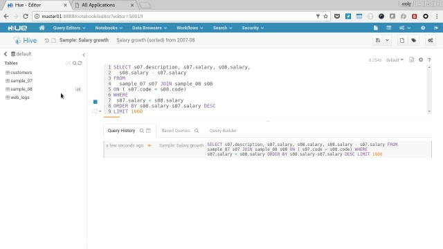

Choose the "Job Browser" icon and open in a new tab, watch the job transition from Accepted->Running->Succeeded.

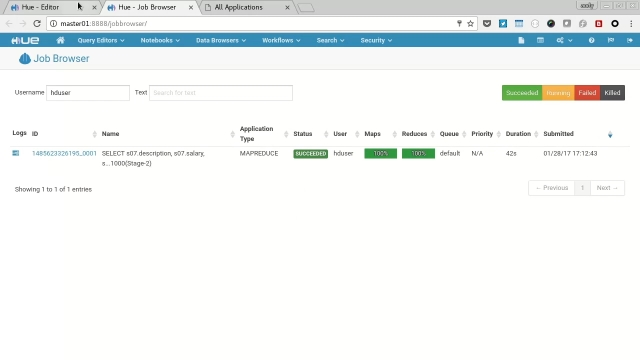

Return to the original query tab and you'll see the results displayed in the browser.

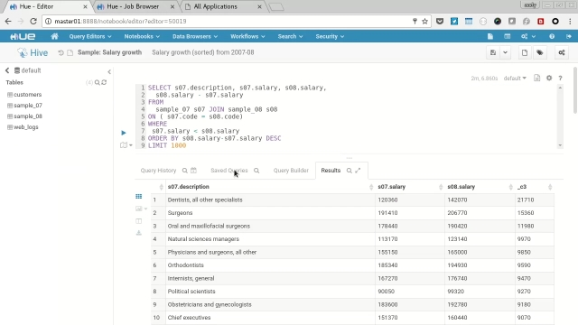

### Pig Example
From the "Query Editor" menu select "Pig", then select the "samples" tab and then the "Upper Text (example)", in the resulting query editor amend the 2nd line to:

      upper_case = FOREACH data GENERATE UPPER(text);

Click the play button to submit the query, you'll be prompted to specify an output path, so choose "/tmp/pigout" and click "Yes".

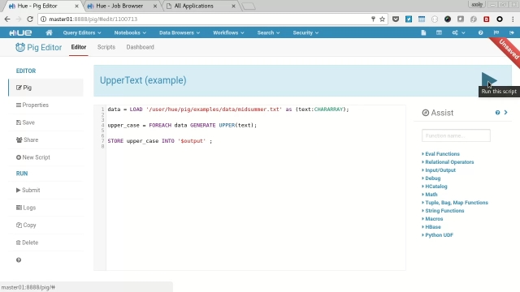

Go to the job browser and wait for the two generated jobs to finish, then click the "HDFS Browser" icon and navigate to /tmp/pigout and view on e of the "part-m-????" file and see the generated text.

### Spark Notebooks
Spark notebooks are one of the best features of Hue, allowing you to edit code directly in the browser and run it via spark on the cluster. We'll try out the three supported languages Python, Scala and R (we don't have Impala support).

Select "Notebooks" menu and open the "Sample Notebook", we'll need to start a session for each language, we'll try Python first so click the "context" icon to open the context menu and then choose "Recreate" next to the PySpark option, this creates a Spark job viewable via the job browser.

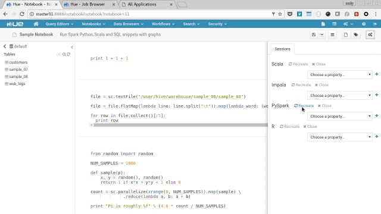

When the session is ready and the job is running, click the "play" icon next to each of the 4 examples and the cluster will calculate the result and display it in the browser, feel free to experiment with the results and edit the code.

When you have finished with the PySpark examples you need to kill the session/job, so on the context menu click "close" next to the PySpark menu.

To try the Scala examples click "Recreate" next to the Scala option on the context menu to create the session and associated job. When running you'll be able to edit Scala code in the browser and interact with the results.

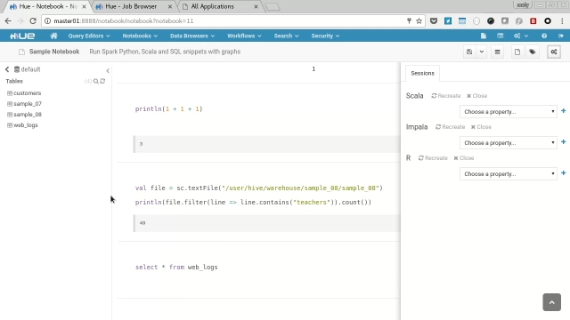

After trying both examples kill the session/job by closing the session on the context menu.

Skip over the Impala examples as they aren't supported.

Start the R session by clicking "create" next to the option and when the job/session have started edit the path in the R sample to
    /tmp/web_logs_1.csv
The R example doesn't used HDFS so you'll need to SSH onto each worker and run:
    curl https://raw.githubusercontent.com/cloudera/hue/master/apps/beeswax/data/web_logs_1.csv -o /tmp/web_logs_1.csv
Back on the Notebook click the play icon next to the code and examine the output including plot.

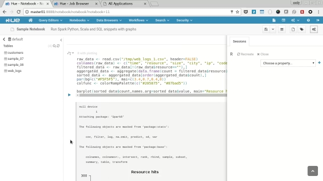

Finally close the session on the context menu so the spark job ends.

### Sqoop example
We're going to use Sqoop to transfer the employee sample data we installed earlier into HDFS. To do this we'll need to configure two Sqoop links and a Sqoop Job.

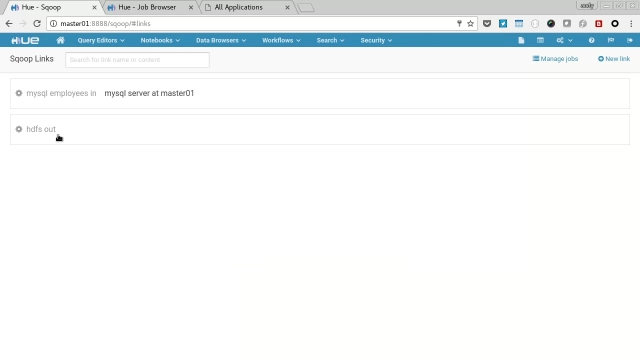

Create the first link by selecting the "Data Browser" and then "Sqoop". Choose "Manage Links" then "Click here to add one"

* Name: mysql employees in
* Connector: generic-jdbc-connector
* JDBC Driver Class: com.mysql.jdbc.Driver
* JDBC Connection String: mysql://master01/employees
* Username: hduser
* Password: ******

Then click "Save", choose "Manage Links" again to add the second link. Click "New Link" and enter the follwoing values:

* Name: hdfs out
* Connector: hdfs-connector
* JDBC Driver Class:
* JDBC Connection String:
* Username: hduser
* Password: ******

We need to then edit that link to complete setting it up, click "Manage Links" the the "hdfs out" link to bring up the edit page. Make the follwoing settings:

* Name: hdfs out
* HDFS URI: hdfs://master01:54310/

Finally click Save.

Next we need to configure the job, select "Click here to add one" and fill out the following:

Step 1: Information
* Name: import employees from mysql to hdfs
* From Link: mysql employees in
* To Link: hdfs out

Step 2: From
* Schema name: employees
* Table name: employees
* Table SQL statement:
* Table column names:
* Partition column name:
* Null value allowed for the partition column:
* Boundary query:

Step 3: To
* Output format: TEXT_FILE
* Compression format: NONE
* Custom compression format:
* Output directory: /tmp/sqoopout

Start the job by clicking "Save and run", navigate to the job browser and wait for the job to be submitted and run sucessfully. Then Navigate to hdfs browser and check the data in "/tmp/sqoopout"

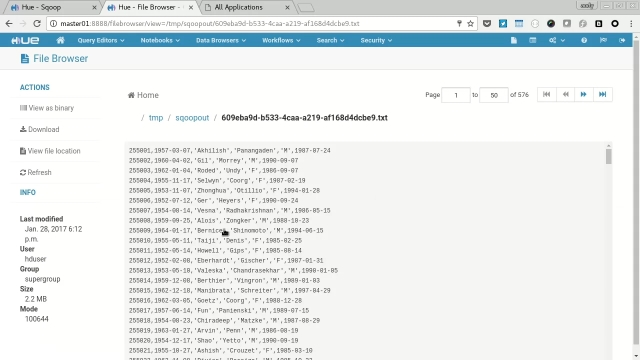

### Ozzie Examples
There are many Ozzie examples installed, so I'll only talk about a few of them here. Lets firstly run the Shell example. Select "Query Editors" from the menu  and the "Job Designer", next click the "Shell" example, you'll be presented with the job editor. I for scroll down you'll see a parameter to the "hello.py" command is "World!".

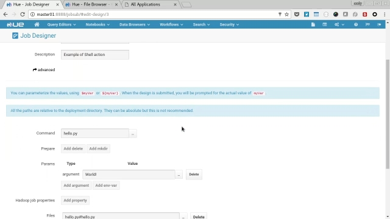

Click the "Submit" button (then confirm) and you'll be presented with the workflow view of the job, wait for the job to run and and select the log icon next "hello.py". In the resulting log you'll see the phrase "Hello World!"

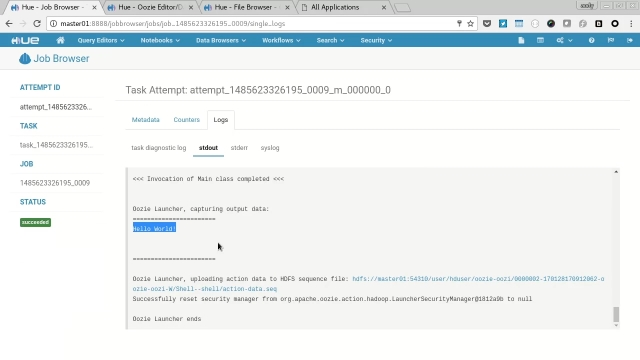

Next let's look at amore complicated workflow, from the menu select "Workflows" -> "Editors" -> "Workflows", on the resulting page select "Spark" and you'll be presented with the job configuration page, for the spark workflow to run we will need to configure the settings for spark, click the "pen" icon to edit the job, next click the "cogs" icon on the spark step to access the steps properties. In the "Options List" filed enter:

    --conf spark.testing.reservedMemory="64000000" --conf spark.testing.memory="128000000" --executor-memory 256m --driver-memory 256m --num-executors 1

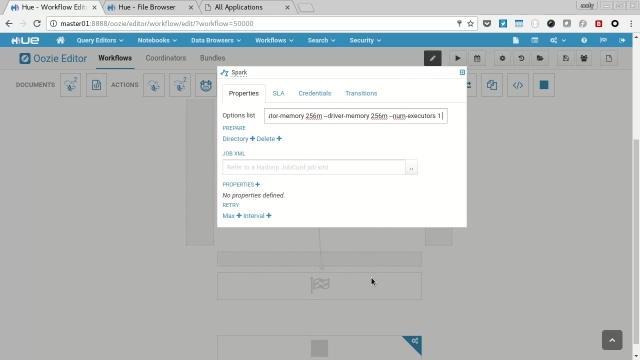

Clck the "disk" icon to save the changs to the workflow and click the "play" icon to submit the job, enter "/tmp/sparkout" into the output field and hit "Submit". Again you'll be presented with the workflow view, wait for the job to finish and then use the hdfs browser to navigate to the "/tmp/sparkout" folder and view one of the data files to check the spark job copied the intended files.

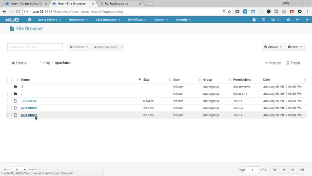

### Solr Dashboards
Select "Search" from the menu and then each of the dashboards in turn (Twitter, Yelp Reviews and Web Logs).

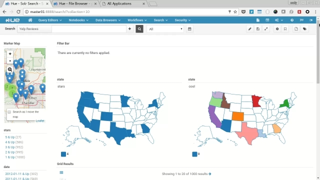

You'll see each present a variety of charts, graphs, maps and text along with interactive filtering features to explore the data held in the solr search indexes.

## Reminder, Power Off the Cluster
Once you have finished experimenting with the cluster please don't just turn off the power, you rick corrupting your data and possibly the sd card. So follow the procedure of running the shutdown scripts on master01 and master02, then running the poweroff command on each of the pis before turning the power off.

## Wrapup
I hope you have fun setting up and playing with the code, I learned a tonne of stuff setting it up and I hope you do too. If you have any improvements then please send pull requests to github, any problems and I'll respond to issues there too.
